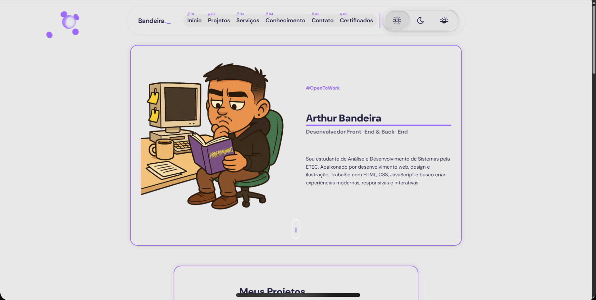
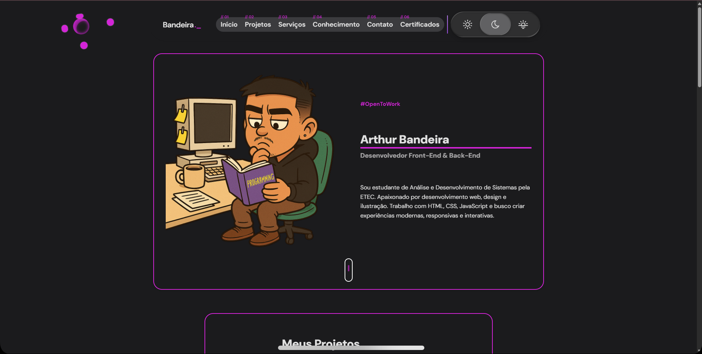

# 💼 Portfólio Interativo — Arthur Bandeira

Bem-vindo ao meu portfólio pessoal! Este projeto foi criado para apresentar minhas habilidades, certificados e projetos como desenvolvedor Full Stack em formação. Tudo com um toque visual moderno, interativo e adaptado a múltiplas tecnologias.

## ✨ Funcionalidades

- 🎯 Apresentação pessoal com animação de digitação
- 📚 Página de certificados interativa com filtros por tecnologia
- 📂 Organização visual com cards 3D animados
- 🌐 Layout responsivo e estilizado com CSS moderno
- 🧠 Foco em tecnologias como HTML, CSS, JavaScript, Git, Java, React e MySQL
- 🔙 Botão “Voltar ao Portfólio” em todas as páginas

## 📸 Visual do Projeto

 
 

---

## 🚀 Acesse o Projeto

- **🔗 Portfólio Online:** [thurbandeira.github.io/Portfolio](https://thurbandeira.github.io/Portfolio/)
- **📑 Página de Certificados:** [thurbandeira.github.io/Portfolio/certificados.html](https://thurbandeira.github.io/Portfolio/certificados.html)

---

## 🛠️ Tecnologias Utilizadas

| Tecnologia | Finalidade |
|------------|------------|
| `HTML5`    | Estrutura das páginas |
| `CSS3`     | Estilização moderna com animações e variáveis |
| `JavaScript` | Interatividade (animações, filtros) |
| `Git & GitHub` | Versionamento e hospedagem |
| `GitHub Pages` | Deploy gratuito do site |
| `VS Code`  | Editor principal |

## 📬 Contato

Caso queira entrar em contato:

- **LinkedIn:** [linkedin.com/in/arthurbandeirasilva](https://www.linkedin.com/in/arthurbandeirasilva)
- **Email:** arthurbandeirasilva09@gmail.com

---

> Este projeto será expandido com mais seções, como “Projetos”, “Serviços” e integração com formulário de contato. Novas tecnologias serão adicionadas conforme avanço nos estudos.

